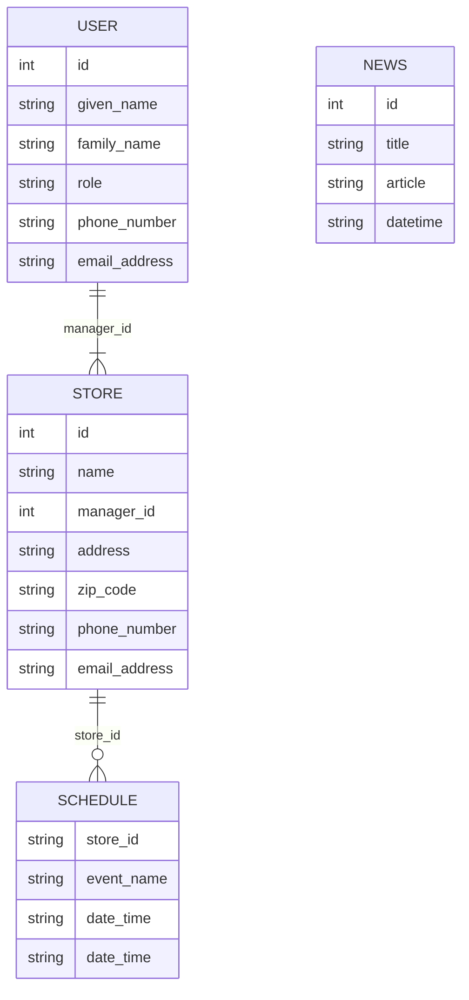

# ER

```mermaid
erDiagram
  USER ||--|{ STORE : manager_id
  USER {
    int id
    string given_name
    string family_name
    string role
    string phone_number
    string email_address
  }

  STORE ||--o{ SCHEDULE : store_id
  STORE {
    int id
    string name
    int manager_id
    string address
    string zip_code
    string phone_number
    string email_address
  }

  SCHEDULE
  SCHEDULE {
    string store_id
    string event_name
    string date_time
    string date_time
  }

  NEWS
  NEWS {
    int id
    string title
    string article
    string datetime
  }
```